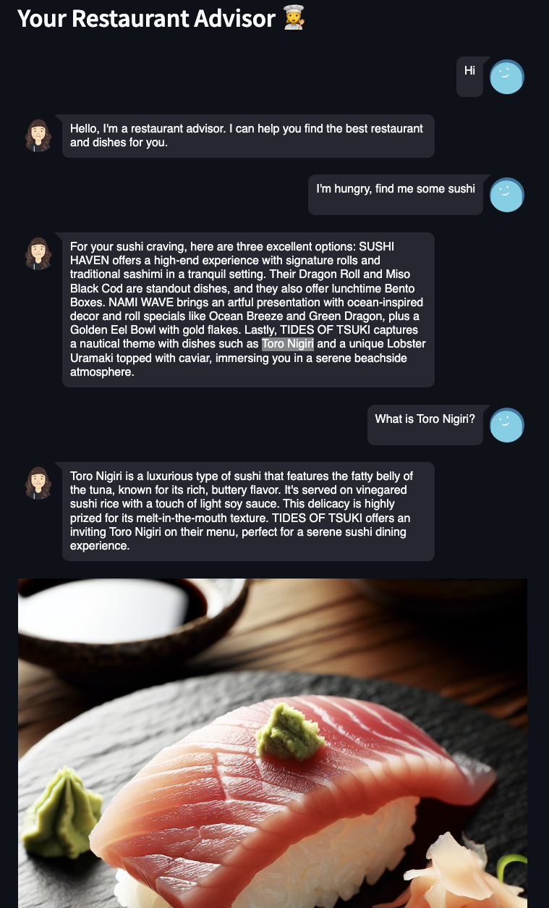

# ai-llm-playground
Experiments with Langchain, OpenAI API, Embedding, and Agents.

# Restaurant Advisor (OpenAI Assistant version)

This is the continuation of the [Restaurant Advisor (outdated Langchain + Redis version)](#restaurant_advisor) project.
I decided to get rid of Langchain and switch to the native OpenAI API. There are few reasons for this:
- OpenAI API now supports agents out of the box (Assistants + Threads). This is basically all I need in my development
- I prefer controllable low level solutions over magical boxes. It is hard to override standard LangChain Agent's behaviour (prompts, output parsers) when you face some limitations. I found it easier and more flexible to write my own custom code rather than using predefined retrieval tools. 
- I got tired of dealing with issues after updating GPT models and libraries

So, It's pure OpenAI API now.

- I use an Assistant API with custom tools: vector semantic search with location pre-filtering (MongoDb Atlas) and image generation (DALL-E 3)
- I don't need Redis for conversation history anymore because OpenAI Threads can do the same
- I use the latest `GPT-4 Turbo` model
- I use OpenAI voice generation

The core of this project is the Assistant with few tools. It is capable of doing the following:
- keep the conversation with the user, suggest restaurants and dishes from the database
- understand when to query the database and come up with queries to find the best restaurants nearby and use the result in the conversation
- understand when a user wants to see a particular dish and generate an image of it using DALL-E 3
- reliably reply in JSON format even though Assistant API doesn't support the JSON output format



Examples of the generated images during a conversation:

   

I'll add more details about how to create the database with indexes in MongoDb Atlas and how to deploy this to AWS later.
I plan to create some architectural diagrams as well. Even thought there is not so much to architect here, but still. There are tools and some tricks with location pre-filtering which require some explanation to those who want to do the same.

# <a name="restaurant_advisor"></a>Restaurant Advisor (outdated Langchain + Redis version)

This chatbot is aware of restaurant database in MongoDB and is capable of finding the best one nearby. It combines vector semantic search with geo-location MongoDb Atlas Index search. It keeps the chatbot conversation history in Redis. It is quite awesome, the most advanced AI project I did so far.

I chose MongoDb as a vector store because of multiple reasons:
- I can to keep documents in a cloud, not only vectors
- My documents are not just text chunks but complex JSON object with a schema
- Each document has `embedding` and `location` fields that are indexed and can be used for fast semantic and geo-location search
- I use geo-location search as a filter for the following vector search. I.e. I limit the search to the restaurants nearby and then I use vector search to find the best one.
- I can use MongoDB native queries if I feel limitations with Langchain API (or in case of bugs which I encountered a few times)

I plan to deploy this to AWS Lambda eventually (I hope soon), thus I need to keep conversation history somewhere. I chose Redis. It is supported by Langchain.
The application supports StreamLit and Flask servers.

To start it locally run a Redis container using the `docker-compose.yml`:
```bash
docker-compose up
```
Then start the Python application as usual (see below).


# AI Girlfriend

Okay, this is not actually a girlfriend but more like an interesting person with some technical background. At first, I took some custom prompts for chatbots with AI-girlfriend personality from [FlowGPT](https://flowgpt.com/). But they all were either anime or virtual sex oriented (usually both) which I found rather boring. I came up with my own prompt that focuses on making the chatbot more alive and natural. I prohibited her to mention that she is an AI and gave some background in engineering so she is quite nerdy. I also tried to make her more open-minded that a regular Chat GPT, therefore she has some temper and can even insult you (she called me stupid once). She can talk using AI-generated voice which is very impressive. 

In the end, this is a simple chatbot created with Langchain, Streamlit, and OpenAI API. It can voice-talk almost like a real human using Elevenlabs API.  
I use the [Elevenlabs](https://elevenlabs.io/speech-synthesis) API (which is free) to generate a voice in a browser (StreamLit allows to play it).


# Chat with Multiple Documents

Here I use vector database to store txt documents' content. Langchain with `stuff` chain type allows to query this store and use it in chatting with llm


# Setup

Rename the [.env.template](.env.template) file into `.env` and fill in the values.

### Pipenv setup

I use `pipenv` to manage dependencies. Install it, create a virtual environment, activate it and install dependencies.

1. Install `pipenv` using official [docs](https://pipenv.pypa.io/en/latest/install/#installing-pipenv). For example, on Mac:
    ```bash
    pip install pipenv --user
    ```

2. Add `pipenv` to PATH if it's not there. For example, I had to add to the `~/.zshrc` file the following line:
    ```bash
    export PATH="/Users/hiper2d/Library/Python/3.11/bin:$PATH"
    ```

3. Install packages and create a virtual environment for the project:
    ```bash
    cd <project dir> # navigate to the project dir
    pipenv install
    ```
    This should create a virtual environment and install all dependencies from `Pipfile.lock` file.

    If for any reason you need to create a virtual environment manually, use the following command:
    ```bash
    pip install virtualenv # install virtualenv if you don't have it
    virtualenv --version # check if it's installed
    cd <virtualenv dir> # for example, my virtual envs as here: /Users/hiper2d/.local/share/virtualenvs
    virtualenv <virtualenv name> # I usually use a project name
    ```

4. To swtich to the virtual environment, use the following command:
    ```bash
    cd <project dir>
    pipenv shell
    ```
    If this fails, than do the following:
    ```bash
    cd <virtualenv dir>/bin
    source activate
    ```

### Intellij Idea/PyCharm Run/Debug setup

1. Add a Python Interpreter. Idea will generate a virtual environment for you.
   - Go to Project Settings > SDK > Add SDK > Python SDK > Pipenv Environment
   - Add paths to python and pipenv like this:
     

2. Create a Python StreamLit Run/Debug configuration like this:
   

3. Create a Python Flask Run/Debug configuration (in dish-adviser only) like this:
    