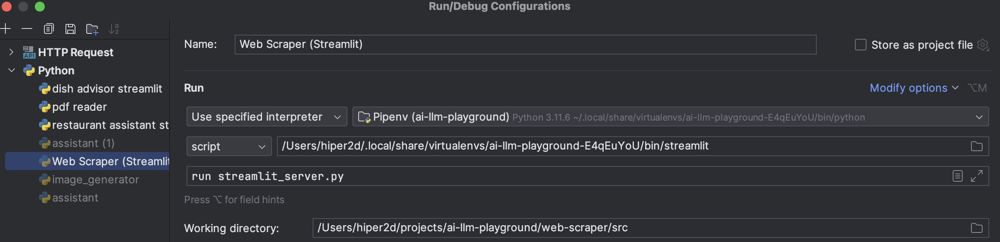

# Setup

You need both Python and Node.js to use this project.

```bash
# Install Python dependencies
# Navigate to the root project directory: ai-llm-playground
pipenv shell
pipenv intall

# Install Node.js dependencies
# navigate to the web-scraper directory: web-scraper
cd web-scraper
npm install
```

This is how I setup my Intellij Idea project run configuration for Streamlit:


